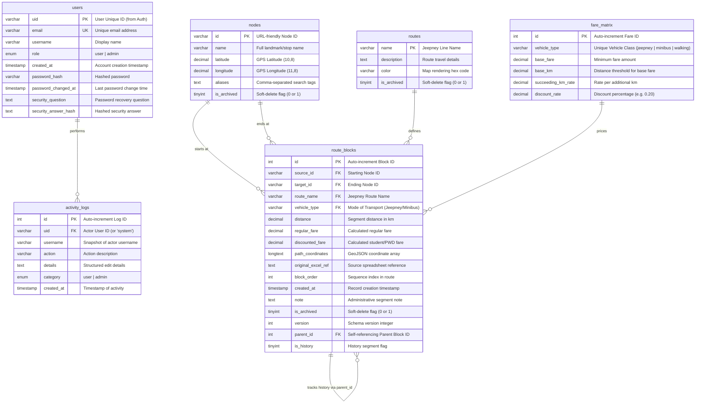

# ViaGraph Entity-Relationship Diagram (ERD)

This document contains the Entity-Relationship Diagram (ERD) for the **Iligan RouteFinder (ViaGraph)** database. The system utilizes a unified **MySQL Relational Database** (`viagraph_experiment`) to support both the administrative route management interface and the real-time, shortest-path routing engine.

---

## 1. MySQL Relational Schema (Crow's Foot Notation)

This diagram visualizes the MySQL database structure. It utilizes standard Crow's Foot notation to represent relationships, indicating optionality and cardinality.

### Legend
* `||--o{` : Exactly **One** to **Zero-or-Many** (e.g., a route has zero or many route blocks).
* `PK` : Primary Key.
* `FK` : Foreign Key.
* `UK` : Unique Key.

---

## 2. MySQL Data Dictionary

### Table: `users`
Stores user authentication profile data and permission details.

| Column | Data Type | Keys / Constraints | Description |
| :--- | :--- | :--- | :--- |
| `uid` | `varchar(128)` | **PK** | Standard UUID or unique user identifier. |
| `email` | `varchar(255)` | **Unique** | User email address. |
| `username` | `varchar(255)` | - | User display name. |
| `role` | `enum('user', 'admin')` | Default: `'user'` | Determines administrative privilege. |
| `created_at` | `timestamp` | Default: `current_timestamp()` | Account registration timestamp. |
| `password_hash` | `varchar(255)` | - | Hashed password. |
| `password_changed_at` | `timestamp` | - | Time of the last password update. |
| `security_question` | `text` | - | Text of the security question for password reset. |
| `security_answer_hash` | `text` | - | Hashed answer for security verification. |

### Table: `nodes`
Represents physical locations, landmarks, or transit stops in Iligan City.

| Column | Data Type | Keys / Constraints | Description |
| :--- | :--- | :--- | :--- |
| `id` | `varchar(100)` | **PK** | String slug identifier (e.g., `gaisano-mall`, `msu-iit`). |
| `name` | `varchar(255)` | - | Official display name of the stop. |
| `latitude` | `decimal(10,8)` | - | Latitude coordinates. |
| `longitude` | `decimal(11,8)` | - | Longitude coordinates. |
| `aliases` | `text` | - | Alternative names/search tags. |
| `is_archived` | `tinyint(1)` | Default: `0` | Active indicator (1 = archived/soft-deleted, 0 = active). |

### Table: `routes`
Defines the official transit routes (jeepney or minibus lines) running in the city.

| Column | Data Type | Keys / Constraints | Description |
| :--- | :--- | :--- | :--- |
| `name` | `varchar(100)` | **PK** | Unique route identifier (e.g., `BURUUN JEEP`, `Tambo-Gerona`). |
| `description` | `text` | - | Details regarding route paths and stops. |
| `color` | `varchar(20)` | Default: `'#6366f1'` | Hex code color used to draw the route on the map. |
| `is_archived` | `tinyint(1)` | Default: `0` | Active indicator (1 = archived/soft-deleted, 0 = active). |

### Table: `route_blocks`
Represents directed links (edges) connecting two nodes on a specific transit route.

| Column | Data Type | Keys / Constraints | Description |
| :--- | :--- | :--- | :--- |
| `id` | `int(11)` | **PK**, Auto Increment | Unique record key. |
| `source_id` | `varchar(100)` | **FK** -> `nodes.id` | Start point node identifier. |
| `target_id` | `varchar(100)` | **FK** -> `nodes.id` | End point node identifier. |
| `route_name` | `varchar(100)` | **FK** -> `routes.name` (Implicit) | The transit route this block belongs to. |
| `vehicle_type` | `varchar(50)` | **FK** -> `fare_matrix.vehicle_type` (Implicit) | Class of transport used (e.g., `jeepney`, `minibus`). |
| `distance` | `decimal(10,3)` | - | Distance in kilometers. |
| `regular_fare` | `decimal(10,2)` | - | Base fare plus subsequent mileage rate. |
| `discounted_fare` | `decimal(10,2)` | - | Discounted fare (e.g., student/PWD). |
| `path_coordinates` | `longtext` | JSON Array string | GPS coordinate path list for detailed map rendering. |
| `original_excel_ref` | `text` | - | Raw spreadsheet provenance log. |
| `block_order` | `int(11)` | Default: `1` | Order index of this block within the route's path. |
| `created_at` | `timestamp` | Default: `current_timestamp()` | Creation timestamp. |
| `note` | `text` | - | Administrative note regarding edits or overrides on this block. |
| `is_archived` | `tinyint(1)` | Default: `0` | Active indicator (1 = archived/soft-deleted, 0 = active). |
| `version` | `int(11)` | Default: `1` | Incremental database edit version tag. |
| `parent_id` | `int(11)` | **FK** -> `route_blocks.id` | Links back to the original block ID if this is a historical edit. |
| `is_history` | `tinyint(4)` | Default: `0` | Boolean indicator for whether this record is an active route block or just saved history. |

### Table: `fare_matrix`
Determines routing cost calculations according to transit vehicle classes.

| Column | Data Type | Keys / Constraints | Description |
| :--- | :--- | :--- | :--- |
| `id` | `int(11)` | **PK**, Auto Increment | Unique rate ID. |
| `vehicle_type` | `varchar(50)` | - | Class name (e.g., `jeepney`, `minibus`, `walking`). |
| `base_fare` | `decimal(10,2)` | - | Initial charge. |
| `base_km` | `decimal(10,2)` | - | Distance covered under the base fare. |
| `succeeding_km_rate`| `decimal(10,2)` | - | Additive fare charge per succeeding kilometer. |
| `discount_rate` | `decimal(5,2)` | - | Proportional discount rate (e.g. `0.20` represents a 20% discount). |

### Table: `activity_logs`
Provides auditable audit trails of administrative modifications.

| Column | Data Type | Keys / Constraints | Description |
| :--- | :--- | :--- | :--- |
| `id` | `int(11)` | **PK**, Auto Increment | Log sequence key. |
| `uid` | `varchar(128)` | **FK** -> `users.uid` (Implicit) | Actor ID (`system` for automated scripts). |
| `username` | `varchar(255)` | - | Actor display name at log time. |
| `action` | `varchar(255)` | - | Action performed (e.g., `Updated Route`, `Changed Password`). |
| `details` | `text` | - | Contextual logs of modified fields. |
| `category` | `enum('user', 'admin')` | - | Level classification of actions. |
| `created_at` | `timestamp` | Default: `current_timestamp()` | Date/time of execution. |
